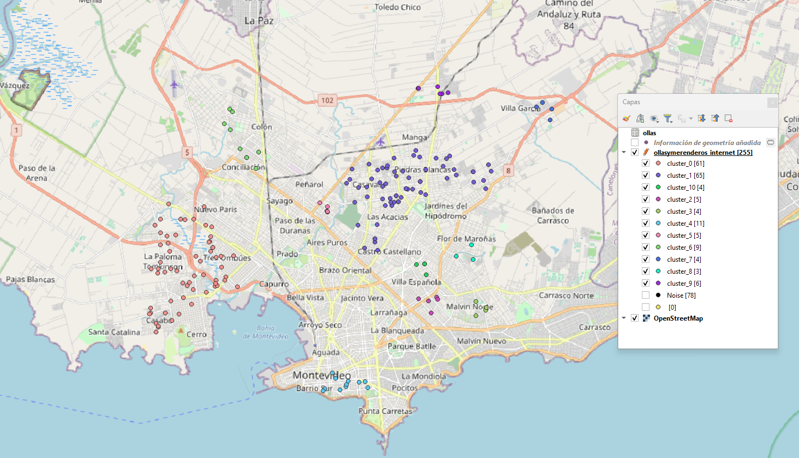
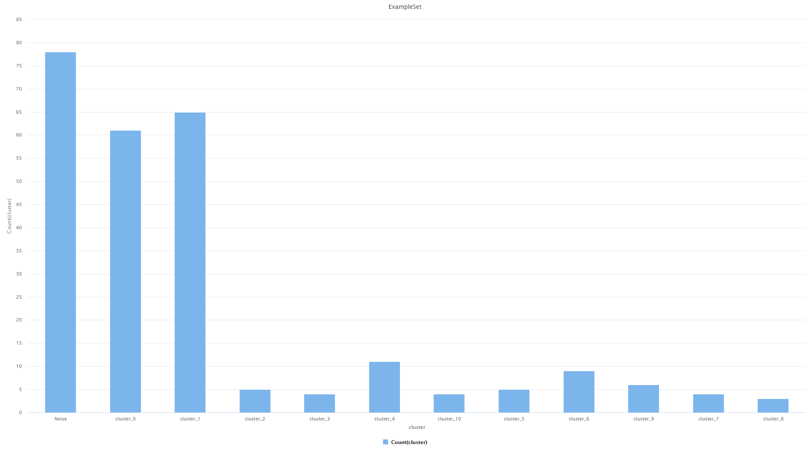

Debido a la situación social generada por la pandemia global, en el último tiempo ha habido un aumento en la cantidad de ollas y merenderos en Montevideo. La Intendencia de Montevideo disponibilizó la información de las ollas apoyadas por sus programas. 
Este dataset contiene la ubicación en coordenadas geográficas de las ollas, por lo que es un buen caso de estudio para encontrar aquellas regiones con una alta concentración de ollas. Esta información puede ser relevante para mejorar las políticas de apoyo, al permitir desarrollar una mejor logística por ejemplo.

## Clustering

Clustering es la técnica para encontrar grupos relevantes en la información disponible. En este caso, el objetivo no es predecir una clase, sino descubrir posibles agrupamientos.
La principal diferencia entonces con un problema de clasificación es que a priori no se conocen las clases posibles, sino que justamente el proceso de clustering las intenta descubrir.

Según el enfoque tenga la técnica de clustering, se puede clasificar de varias maneras. Aquí se utilizará el enfoque de clustering por densidad. Se puede definir cluster como una región en la que los datos están concentrados, es decir hay muchos datos en separados por poca distancia. A la vez, estas regiones densas están rodeadas por otra de baja densidad, en la que los datos se llamarán ruido. Una de las principales ventajas sobre otras técnicas de clustering, es que no requiere a priori conocer en cuántas posibles regiones podrían separarse los datos; esto lo hace muy útil como una técnica de exploración de datos.

El principal algoritmo que utiliza este enfoque, es DBSCAN. El algoritmo tiene 3 pasos.

1. Definir Epsilon y MinPoints. Para determinar si un punto está en un región de densidad, hay que definir el radio (epsilon) alrededor del punto dentro del cual debe haber una cierta cantidad (MinPoints) de otros puntos. 
Durante esta investigación se observó que ambos parametros deben ser manejados en conjunto. Por ejemplo definir un MinPoints bajo y un epsilon alto, puede provocar que casi todos los puntos pertenezcan a un mismo cluster, ya que estaría definiendo un bajo requisito para clasificar una región como de densidad. En cambio definir un MinPoints alto y un epsilon bajo, haría que casi todos los puntos sean clasificados como ruido, ya que se haría muy exigente la definición de alta densidad.
2. Clasificar los datos. Pueden ser Núcleo (los puntos dentro del radio epsilon de otro punto), Frontera (aquel punto que esté exactamente a una distancia epsilon de otro punto) y Ruido (todos los demas)
3. Clustering. Si dos puntos están dentro del epsilon del otro, se marcan como pertenecientes al mismo cluster. Aquellos puntos que no hayan quedado dentro del epsilon de ningun otro punto, se marcan como ruido.

### Obtención de datos y preparación

El link de acceso a la información está aquí: https://geoweb.montevideo.gub.uy/geonetwork/srv/spa/catalog.search#/metadata/54e1b5e2-f32e-4688-8d12-a05966eb4f0a

Allí se encuentra el dataset en el formato de Shapefile. Un shapefile es un formato de archivo utilizado en Sistemas de Información Geográfica (GIS). Es un formato  vectorial en el que se guarda la coordenada geográfica de los puntos de interés, además de los atributos asociados a cada uno de ellos. 

Para obtener un formato utilizable por Rapidminer, se utilizó el software QGIS, que permite importar un shapefile y luego exportarlo en formato CSV, conteniendo las coordenadas geográficas. Además, permite visualizar los puntos sobre un mapa. El archivo obtenido tiene estas columnas:

1. Código: generado como Identificador único de la actividad
2. Municipio: el municipio de Montevideo en el que está ubicado
3. Nombre: nombre de la iniciativa
4. Actividad: tipo de actividad que se desarrolla. Puede tomar los siguientes valores:
    - Olla
    - Merendero
    - Olla y Merendero
    - Entrega Canastas
5. Dirección: ubicación de la iniciativa, tiene formato de texto libre
6. Días: días de atención
7. Horario: horario de atención
8. Activa: todas las filas figuran como activas
9. COD_NOMBRE: Código de la calle según Nomenclator
10. NUM_PUERTA: Numero de puerta
11. LETRA: Letra o bis del numero de puerta
12. xcoord: coordenada x de la ubicación geográfica (Real)
13. ycoord: coordenada y de la ubicación geográfica (Real)

A los efectos de este ejercicio solamente se tomará en consideración el código, como forma de identificación y las coordenadas geográficas.

Se identifican 255 datos válidos.

## Proceso en Rapidminer

El proceso en Rapidminer es sencillo, debido a la poca cantidad de atributos en el dataset y a que DBSCAN solamente requiere dos parámetros. 

En primer lugar se selecciona el Código como atributo de rol ID. Al ser un ejercicio de clustering, no se requiere identificar un atributo como label. Se seleccionan los atributos de coordenadas para crear el modelo y el Código para luego poder reconstruir el dataset.

La salida del modelo se escribe en un nuevo CSV, que luego será importado nuevamente a QGIS para poder mostrar los resultados sobre el mapa. El CSV contendrá unicamente el Código y una identificacón de cluster, ya que la aplicación QGIS permite hacer un join con sus datos previamente contenidos.

El Sistema de Referencia de Coordenadas en que QGIS exporta las coordenadas es el EPSG:32721. EPSG es un sistema de coordenadas que tiene la ventaja de que un metro equivale a una unidad del sistema de coordenadas. Es decir, que dos puntos distantes entre si 100 metros, tendrán la distancia euclidiana 100 en este sistema de coordenadas. La contracara de esto, es que para evitar distorsiones en la representación, debe dividir el planeta en varias zonas, dentro de las cuales tienen sentido las coordendas. La 32721 es la que corresponde a nuestro país. Más información al respecto puede encontrarse [aquí](https://epsg.io/32721).

La elección de los parámetros para el DBSCAN no deja de ser hasta cierto punto arbitraria y depende en gran medida del tipo de información que se quiera obtener. Si el objetivo es encontrar regiones en particular dónde haya una gran concentración de ollas, se deben aplicar parámetros estrictos con un Epsilon pequeño y MinPoints alto, sin embargo esto probablemente deje una gran cantidad de puntos marcados como ruido. Aquí se quiere identificar en general aquellos barrios donde haya concentración de ollas, por lo que se aplicarán parámetros más laxos. Luego de un análisis preeliminar y experimentación con diferentes posibles parámetros, se optó por un Epsilon de 1000 y MinPoints 4. Es decir, aquellas zonas en las que haya al menos 4 bocas en un radio de 1km.

## Análisis de resultados

Como se observa en los mapas (el primero incluye solo los clusters y el segundo agrega el ruido), se obtuvieron dos zonas principales. La primera concentrada en los barrios Casabó, Piedras Blancas y Las Acacias con 65 datos y la segunda en el entorno de los barrios Tres Ombúes, Cerro y Casabó, con 61 datos. Le siguen otros dos clusters, uno en la zona del Centro con 11 datos y otro en Conciliación con 9. El resto son más pequeños en comparación con entre 3 y 6 datos cada uno.

Vale la pena observar precisamente el cluster 8, que tiene solamente 3 datos, a pesar de que se había definido como 4 como el valor de MinPoints. Esto se debe a que el algoritmo cataloga como Punto Núcleo únicamente a aquellos puntos que tengan MinPoints elementos en su radio Epsilon. Sin embargo puede darse que un punto que sirvió para catalogar como Núcleo a otro, no llegue a tener a su vez suficientes puntos en su radio para ser catalogado el mismo como Núcleo. Este fue el caso precisamente con el cluster 8, en la zona de Maroñas. Esta particularidad del algoritmo no había sido tenida en cuenta por el autor hasta observar este caso.

Finalmente quedan 78 puntos marcados como ruido, esto es un 30,6% del total. Esto, así como la presencia de 51 puntos (20%) en clusters relativamente pequeños en comparación con los principales dos, puede servir de indicación de que el fénomeno, si bien muy fuerte en dos puntos principales, también está bastante extendido por la ciudad en general. De hecho, si observamos el mapa, vemos que únicamente la franja costera este no tiene presencia de ollas.

Una observación sobre la metodología, es que se utilizaron distancias "a vuelo de pajaro". Es decir, no se utilizó la distancia que recorrería un vehículo o una persona. Se podría preveer que este cambio en la función de distancia genere una diferente clusterización. Por ejemplo, el cluster 0, en la zona de Cerro y Tres Ombués podría dividirse en dos, ya que ambos barrios están separados por el arroyo Pantanoso, por lo que las distancias reales que deben ser recorridas, son mayores a las calculadas con la distancia euclidiana.
